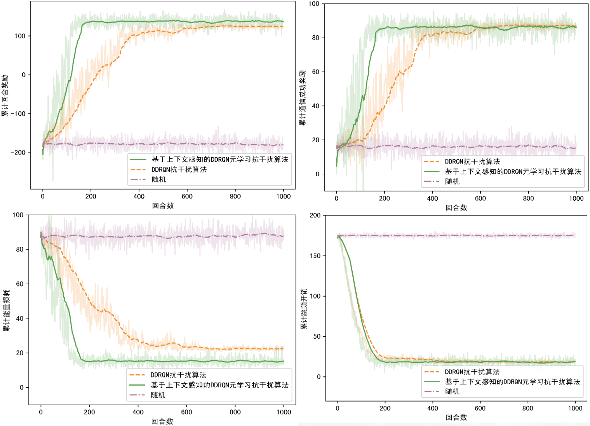

# MetaRL-for-UAV-Anti-jamming
> Patent : An Anti-Jamming Communication Method for Unmanned Cluster Based on Meta-Reinforcement Learning (一种基于元强化学习的无人集群抗干扰通信方法)

*If you have any questions regarding the project, I sincerely welcome you to reach out to me through issues. I will respond to you as soon as possible.*

## 1. Introduction

This repository contains the code and detailed instructions for the patent "An Anti-Jamming Communication Method for Unmanned Cluster Based on Meta-Reinforcement Learning".

We trained multiple models : DQN, PPO, DDRQN, DQN-context, PPO-context, DDRQN-context, RANDOM. The training result are shown below. You can find a full explanation of the images and the environment at `Patent draft.pdf`. 

We chose only the best performing DDRQN-context for the patent, and in the folder `code`, it contains only the code of the model used in the patent.

As shown in the figure below, in the meta-test stage, tasks are randomly sampled from the test set and the performance of the trained model is tested on the new task. 
The convergence speed of the anti-jamming algorithm using context-aware DDRQN element learning is obviously better than other methods. 
This is because the meta-reinforcement learning enables the model to learn the ability to adapt to new tasks more quickly by learning on multiple tasks. 
This generalization ability makes the model perform better in the face of new tasks, and the model learns the common features and patterns between tasks, 
rather than just memorizing the data of a specific task. This learning method makes the model more generalization ability and can better adapt to various tasks. 
In addition, the model communication success reward of the context-aware DDRQN learning anti-jamming algorithm is higher, 
and it uses less power to communicate while ensuring the communication quality, thus prolonging the overall life of the entire network. 
In addition, the algorithm using meta-reinforcement learning can significantly reduce the frequency hopping overhead. 
Higher communication success rate can be achieved under the same frequency hopping overhead.

The above results are out of date, please check the new results in `/code/draw.ipynb`.

Please note that DDRQN is actually just DDQN plus an LSTM module, we later made a change in the name and added "R", all the "DDQN" in the above picture refers to DDRQN, the specific visible code.

## 2. Installation

no more special requirements, 

## 3. Usage

1. Clone the repository by `git clone https://github.com/d3ac/MetaRL-for-UAV-Anti-jamming` or download the zip file. Go to the code folder.
2. run 'task_gen.py' to generate the task set, run `foldergen.py` to generate the folder to save the model and the training result.
3. run 'DDRQN.py', 'DDQM-context.py', 'RANDOM.py' to train the model, You can see how well the model is trained by running `draw.ipynb`.
4. run 'DDRQN-test.py', 'DDRQN-context-test.py', 'RANDOM-test.py' to test the model, You can see the test result by running `draw_test.ipynb`.